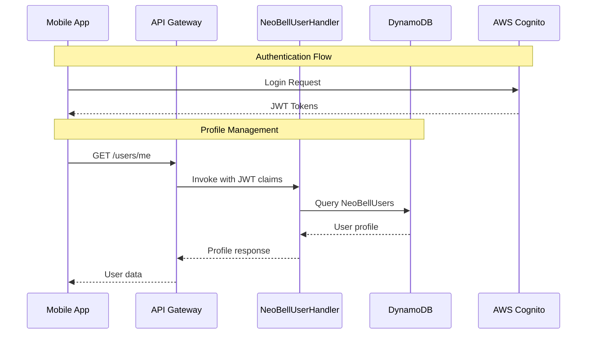

# User & Profile Management API

## Overview
Handles user profile management, device tokens, and NFC tag management.

## API Handler
`NeoBellUserHandler`

## Workflow Diagram



## Endpoints

### 1. Get User Profile
- **Method**: GET
- **Path**: `/users/me`
- **Auth**: Required (Cognito JWT)
- **Description**: Retrieves authenticated user's profile
- **Response (200 OK)**:
```json
{
    "user_id": "cognito_sub_uuid",
    "email": "user@example.com",
    "name": "User Name",
    "profile_created_app_at": "YYYY-MM-DDTHH:mm:ssZ",
    "profile_last_updated_app": "YYYY-MM-DDTHH:mm:ssZ",
    "device_tokens": {
        "android": "token_android_example",
        "ios": "token_ios_example"
    }
}
```

### 2. Update User Profile
- **Method**: PUT
- **Path**: `/users/me`
- **Auth**: Required (Cognito JWT)
- **Request Body**:
```json
{
    "name": "New User Name"
}
```

### 3. Register Device Token
- **Method**: POST
- **Path**: `/users/device-token`
- **Auth**: Required (Cognito JWT)
- **Request Body**:
```json
{
    "push_notification_token": "TOKEN_REAL_DO_DISPOSITIVO_FCM_OU_APNS",
    "device_type": "android"
}
```

### 4. NFC Tag Management
- **Register Tag**: POST `/users/me/nfc-tags`
- **List Tags**: GET `/users/me/nfc-tags`
- **Update Tag**: PUT `/users/me/nfc-tags/{nfc_id_scanned}`
- **Delete Tag**: DELETE `/users/me/nfc-tags/{nfc_id_scanned}`

## Data Model

### NeoBellUsers Table
```javascript
{
    "user_id": "string (PK, Cognito sub)",
    "email": "string",
    "name": "string",
    "profile_created_app_at": "timestamp",
    "profile_last_updated_app": "timestamp",
    "device_tokens": {
        "android": "string",
        "ios": "string"
    }
}
```

### UserNFCTags Table
```javascript
{
    "user_id": "string (PK)",
    "nfc_id_scanned": "string (SK)",
    "tag_friendly_name": "string",
    "registered_at": "timestamp",
    "last_updated_at": "timestamp"
}
```

## Integration Points

### AWS Services
- Amazon Cognito: User authentication
- DynamoDB: Profile and NFC tag storage
- API Gateway: REST API interface
- Lambda: Business logic handling

### Related Workflows
1. User Authentication (Cognito)
2. Push Notification Registration
3. NFC Tag Verification (with NeoBell SBC)

## Error Handling

| Status Code | Description | Common Causes |
|------------|-------------|---------------|
| 400 | Bad Request | Invalid input data |
| 401 | Unauthorized | Invalid/expired JWT |
| 403 | Forbidden | Insufficient permissions |
| 404 | Not Found | Profile/NFC tag not found |
| 409 | Conflict | Duplicate NFC tag |
| 500 | Server Error | Internal processing error |

## Security Considerations
1. JWT token validation
2. Input sanitization
3. Rate limiting
4. Access control validation
5. Secure storage of device tokens