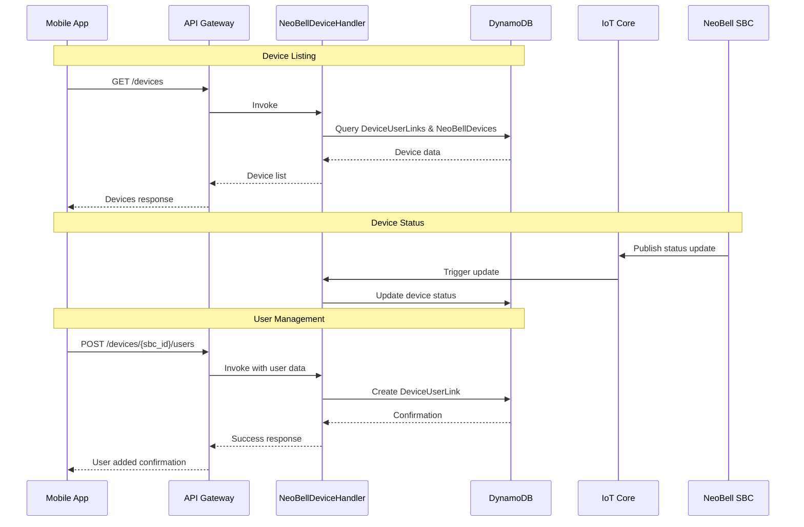

# Device Management API

## Overview
Handles NeoBell device (SBC) management, including device registration, updates, and user access control.

## API Handler
`NeoBellDeviceHandler`

## Workflow Diagram



## Endpoints

### 1. List User's Devices
- **Method**: GET
- **Path**: `/devices`
- **Auth**: Required (Cognito JWT)
- **Query Parameters**: 
  - `limit`: Number of items
  - `last_evaluated_key`: Pagination key
- **Response (200 OK)**:
```json
{
    "items": [
        {
            "sbc_id": "device_uuid_1",
            "device_friendly_name": "Porta da Frente",
            "role_on_device": "Owner",
            "status": "online",
            "last_seen": "YYYY-MM-DDTHH:mm:ssZ"
        }
    ],
    "last_evaluated_key": "optional_pagination_key_stringified_json"
}
```

### 2. Get Device Details
- **Method**: GET
- **Path**: `/devices/{sbc_id}`
- **Auth**: Required (Cognito JWT)
- **Response (200 OK)**:
```json
{
    "sbc_id": "device_uuid_1",
    "owner_user_id": "owner_cognito_sub_uuid",
    "device_friendly_name": "Porta da Frente",
    "user_role_on_device": "Owner",
    "status": "online",
    "firmware_version": "1.2.3",
    "registered_at": "YYYY-MM-DDTHH:mm:ssZ",
    "last_seen": "YYYY-MM-DDTHH:mm:ssZ",
    "network_info": {
        "ip_address": "192.168.1.100",
        "wifi_ssid": "MinhaRedeWifi",
        "signal_strength": -45
    }
}
```

### 3. Update Device
- **Method**: PUT
- **Path**: `/devices/{sbc_id}`
- **Auth**: Required (Cognito JWT, Owner only)
- **Request Body**:
```json
{
    "device_friendly_name": "Nova Câmera da Porta da Frente"
}
```

### 4. Delete Device
- **Method**: DELETE
- **Path**: `/devices/{sbc_id}`
- **Auth**: Required (Cognito JWT, Owner only)

### 5. User Management
- **List Users**: GET `/devices/{sbc_id}/users`
- **Add User**: POST `/devices/{sbc_id}/users`
- **Remove User**: DELETE `/devices/{sbc_id}/users/{user_id_to_remove}`

## Data Model

### NeoBellDevices Table
```javascript
{
    "sbc_id": "string (PK)",
    "owner_user_id": "string",
    "device_friendly_name": "string",
    "status": "string",
    "firmware_version": "string",
    "registered_at": "timestamp",
    "last_seen": "timestamp",
    "network_info": {
        "ip_address": "string",
        "wifi_ssid": "string",
        "signal_strength": "number"
    }
}
```

### DeviceUserLinks Table
```javascript
{
    "sbc_id": "string (PK)",
    "user_id": "string (SK)",
    "role": "string",
    "access_granted_at": "timestamp"
}
```

## Integration Points

### AWS Services
- IoT Core: Device communication
- DynamoDB: Device and user link storage
- API Gateway: REST API interface
- Lambda: Business logic handling
- Cognito: Authentication & authorization

### Related Workflows
1. Device Registration
2. Device Status Updates
3. User Access Management
4. Device Deletion

## Error Handling

| Status Code | Description | Common Causes |
|------------|-------------|---------------|
| 400 | Bad Request | Invalid input/parameters |
| 401 | Unauthorized | Invalid/expired JWT |
| 403 | Forbidden | Not device owner |
| 404 | Not Found | Device/user not found |
| 409 | Conflict | User already linked |
| 500 | Server Error | Internal processing error |

## Security Considerations
1. Owner-only operations validation
2. Device access verification
3. User role validation
4. Input sanitization
5. Rate limiting
6. Audit logging for sensitive operations