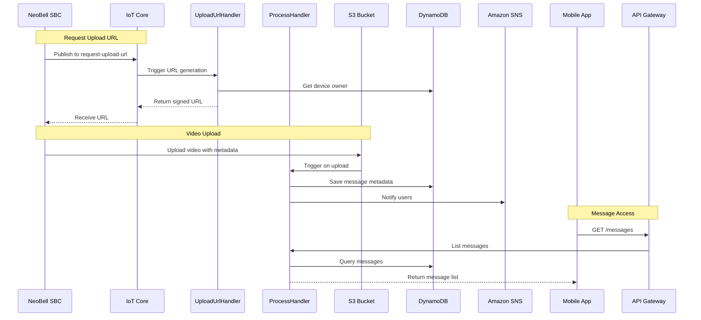

# Video Messages API

## Overview
Handles video message management, including metadata storage, viewing URL generation, and message lifecycle.

## API Handler
`NeoBellMessageHandler`

## Workflow Diagram



## Endpoints

### 1. List Video Messages
- **Method**: GET
- **Path**: `/messages`
- **Auth**: Required (Cognito JWT)
- **Query Parameters**:
  - `sbc_id`: Filter by device
  - `start_date`: Filter from date
  - `end_date`: Filter to date
  - `is_viewed`: Filter by view status
  - `limit`: Pagination limit
  - `last_evaluated_key`: Pagination key
- **Response (200 OK)**:
```json
{
    "items": [
        {
            "message_id": "message_uuid_1",
            "sbc_id": "device_uuid_1",
            "device_friendly_name": "Porta da Frente",
            "recorded_at": "YYYY-MM-DDTHH:mm:ssZ",
            "duration_sec": 30,
            "visitor_name_if_known": "Entregador João"
        }
    ],
    "last_evaluated_key": "optional_pagination_key_stringified_json"
}
```

### 2. Get Message Details
- **Method**: GET
- **Path**: `/messages/{message_id}`
- **Auth**: Required (Cognito JWT)
- **Response (200 OK)**:
```json
{
    "message_id": "message_uuid_1",
    "sbc_id": "device_uuid_1",
    "device_friendly_name": "Porta da Frente",
    "user_id": "cognito_sub_uuid_of_message_owner",
    "recorded_at": "YYYY-MM-DDTHH:mm:ssZ",
    "duration_sec": 30,
    "s3_bucket_name": "seu-bucket-s3",
    "s3_object_key": "path/to/video/in/s3.mp4",
    "visitor_name_if_known": "Entregador João",
    "visitor_face_tag_id": "face_uuid_visitante_xxx"
}
```

### 3. Generate View URL
- **Method**: POST
- **Path**: `/messages/{message_id}/view-url`
- **Auth**: Required (Cognito JWT)
- **Response (200 OK)**:
```json
{
    "message_id": "message_uuid_1",
    "view_url": "https://s3-presigned-url...",
    "expires_at": "YYYY-MM-DDTHH:mm:ssZ"
}
```

### 4. Delete Message
- **Method**: DELETE
- **Path**: `/messages/{message_id}`
- **Auth**: Required (Cognito JWT, Owner/Device Owner only)

## Data Model

### VideoMessages Table
```javascript
{
    "sbc_id": "string (PK)",
    "recorded_at": "string (SK)",
    "message_id": "string (GSI-PK)",
    "user_id": "string",
    "duration_sec": "number",
    "s3_bucket_name": "string",
    "s3_object_key": "string",
    "visitor_face_tag_id": "string (optional)",
    "visitor_name_if_known": "string (optional)"
}
```

## Integration Points

### AWS Services
- S3: Video storage
- IoT Core: Device communication
- DynamoDB: Metadata storage
- SNS: Push notifications
- Lambda: Business logic
- API Gateway: REST API
- CloudWatch: Monitoring

### Related Workflows
1. Video Upload Process
   - Request upload URL
   - Upload video
   - Process metadata
   - Notify users

2. Video Access Process
   - List available messages
   - Generate temporary URLs
   - Track views

## Error Handling

| Status Code | Description | Common Causes |
|------------|-------------|---------------|
| 400 | Bad Request | Invalid parameters |
| 401 | Unauthorized | Invalid token |
| 403 | Forbidden | No access to device/message |
| 404 | Not Found | Message not found |
| 500 | Server Error | Processing error |

## Security Considerations

### Access Control
1. Device ownership verification
2. User access validation
3. Temporary URL expiration
4. Resource-level permissions

### Data Protection
1. S3 encryption at rest
2. Secure URL generation
3. Metadata protection
4. Access logging

## Performance Optimization

### Video Storage
1. Configurable retention periods
2. Lifecycle policies
3. Object expiration

### URL Generation
1. Caching mechanisms
2. URL reuse within expiry
3. Rate limiting

## Monitoring
1. Video upload success rates
2. Processing times
3. Storage usage
4. Access patterns
5. Error rates

## Best Practices
1. Implement video compression
2. Use efficient metadata indexing
3. Implement access auditing
4. Regular cleanup of expired content
5. Handle upload interruptions