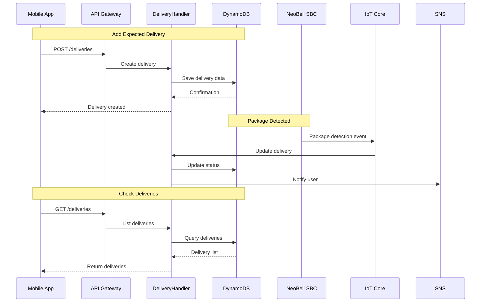

# Package Deliveries API

## Overview
Manages expected package deliveries, tracking, and delivery status updates.

## API Handler
`NeoBellDeliveryHandler`

## Workflow Diagram



## Endpoints

### 1. List Deliveries
- **Method**: GET
- **Path**: `/deliveries`
- **Auth**: Required (Cognito JWT)
- **Query Parameters**:
  - `status`: Filter by status
  - `limit`: Number of items
  - `last_evaluated_key`: Pagination key
- **Response (200 OK)**:
```json
{
    "items": [
        {
            "user_id": "cognito_sub_uuid",
            "order_id": "order_uuid_1",
            "item_description": "Novo Livro",
            "tracking_number": "1Z999AA10123456784",
            "carrier": "UPS",
            "status": "pending",
            "sbc_id_received_at": null,
            "added_at": "YYYY-MM-DDTHH:mm:ssZ",
            "expected_date": "YYYY-MM-DD",
            "received_at_timestamp": null
        }
    ],
    "last_evaluated_key": "optional_pagination_key_stringified_json"
}
```

### 2. Add New Delivery
- **Method**: POST
- **Path**: `/deliveries`
- **Auth**: Required (Cognito JWT)
- **Request Body**:
```json
{
    "item_description": "Fones de Ouvido Novos",
    "tracking_number": "OPTIONAL_TRACKING_NUM",
    "carrier": "FedEx",
    "expected_date": "YYYY-MM-DD"
}
```
- **Response (201 Created)**:
```json
{
    "user_id": "cognito_sub_uuid",
    "order_id": "generated_or_provided_order_uuid",
    "item_description": "Fones de Ouvido Novos",
    "tracking_number": "OPTIONAL_TRACKING_NUM",
    "carrier": "FedEx",
    "status": "pending",
    "added_at": "YYYY-MM-DDTHH:mm:ssZ",
    "expected_date": "YYYY-MM-DD"
}
```

### 3. Get Delivery Details
- **Method**: GET
- **Path**: `/deliveries/{order_id}`
- **Auth**: Required (Cognito JWT)

### 4. Update Delivery
- **Method**: PUT
- **Path**: `/deliveries/{order_id}`
- **Auth**: Required (Cognito JWT)
- **Request Body**:
```json
{
    "status": "retrieved_by_user",
    "item_description": "Descrição Atualizada do Item"
}
```

### 5. Delete Delivery
- **Method**: DELETE
- **Path**: `/deliveries/{order_id}`
- **Auth**: Required (Cognito JWT)

## Data Model

### Deliveries Table
```javascript
{
    "user_id": "string (PK)",
    "order_id": "string (SK)",
    "item_description": "string",
    "tracking_number": "string (optional)",
    "carrier": "string (optional)",
    "status": "string",
    "sbc_id_received_at": "string (optional)",
    "added_at": "timestamp",
    "expected_date": "string (YYYY-MM-DD)",
    "received_at_timestamp": "timestamp (optional)"
}
```

### Status Values
- `pending`: Awaiting delivery
- `in_box1`: Received in box 1
- `in_box2`: Received in box 2
- `retrieved_by_user`: Package collected
- `cancelled`: Delivery cancelled

## Integration Points

### AWS Services
- DynamoDB: Delivery data storage
- IoT Core: SBC communication
- SNS: Push notifications
- Lambda: Business logic
- API Gateway: REST API

### Related Workflows
1. Package Detection Process
   - SBC detects package
   - Updates delivery status
   - Notifies user

2. Package Retrieval Process
   - User marks as retrieved
   - Updates status
   - Archives delivery data

## Error Handling

| Status Code | Description | Common Causes |
|------------|-------------|---------------|
| 400 | Bad Request | Invalid input data |
| 401 | Unauthorized | Invalid token |
| 403 | Forbidden | Access denied |
| 404 | Not Found | Delivery not found |
| 500 | Server Error | Processing error |

## Security Considerations

### Access Control
1. User ownership verification
2. Device access validation
3. Status update authorization

### Data Protection
1. Secure storage of tracking info
2. Access logging
3. Update history tracking

## Performance Optimization

### Query Patterns
1. Status-based indexing
2. Date range queries
3. User-specific queries

### Notification Handling
1. Batch processing
2. Rate limiting
3. Retry mechanisms

## Monitoring
1. Delivery success rates
2. Processing times
3. Status transitions
4. Error patterns
5. User engagement metrics

## Best Practices
1. Implement status validation
2. Track delivery updates
3. Archive old deliveries
4. Handle duplicate notifications
5. Validate tracking numbers
6. Implement delivery expiration