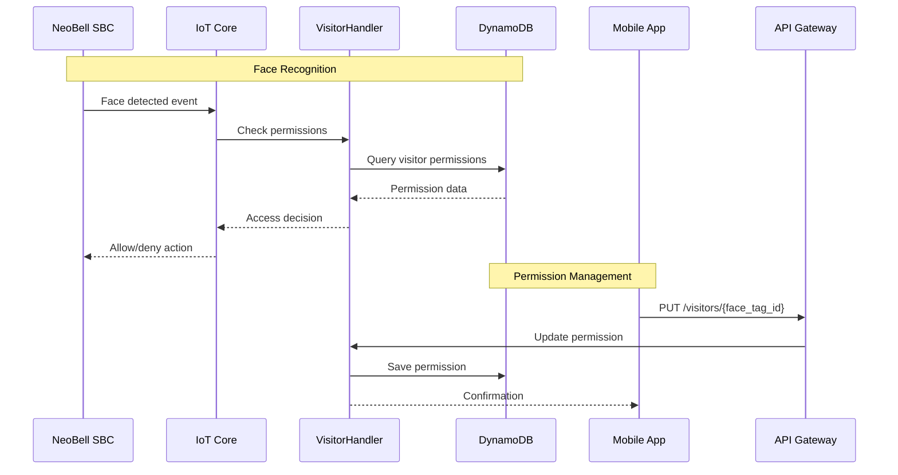

# Visitor Permissions API

## Overview
Manages visitor permissions based on facial recognition, including permission levels and visitor management.

## API Handler
`NeoBellVisitorHandler`

## Workflow Diagram



## Endpoints

### 1. List Visitors/Permissions
- **Method**: GET
- **Path**: `/visitors`
- **Auth**: Required (Cognito JWT)
- **Query Parameters**:
  - `limit`: Number of items
  - `last_evaluated_key`: Pagination key
- **Response (200 OK)**:
```json
{
    "items": [
        {
            "user_id": "cognito_sub_uuid",
            "face_tag_id": "face_uuid_1",
            "visitor_name": "Carteiro João",
            "permission_level": "Allowed",
            "created_at": "YYYY-MM-DDTHH:mm:ssZ",
            "last_updated_at": "YYYY-MM-DDTHH:mm:ssZ"
        }
    ],
    "last_evaluated_key": "optional_pagination_key_stringified_json"
}
```

### 2. Update Visitor/Permission
- **Method**: PUT
- **Path**: `/visitors/{face_tag_id}`
- **Auth**: Required (Cognito JWT)
- **Request Body**:
```json
{
    "visitor_name": "Carteiro João (Amigo)",
    "permission_level": "Allowed"
}
```

### 3. Delete Visitor/Permission
- **Method**: DELETE
- **Path**: `/visitors/{face_tag_id}`
- **Auth**: Required (Cognito JWT)

## Data Model

### VisitorPermissions Table
```javascript
{
    "user_id": "string (PK)",
    "face_tag_id": "string (SK)",
    "visitor_name": "string",
    "permission_level": "string",
    "created_at": "timestamp",
    "last_updated_at": "timestamp"
}
```

### Permission Levels
- `Allowed`: Can leave video messages
- `Denied`: No access allowed

## Integration Points

### AWS Services
- IoT Core: Real-time device communication
- DynamoDB: Permission storage
- Lambda: Business logic
- API Gateway: REST API interface
- Rekognition: Face detection (via SBC)

### Related Workflows
1. Face Detection Process
   - SBC detects face
   - Checks permissions
   - Takes appropriate action

2. Permission Management
   - Create/update permissions
   - Delete permissions
   - Permission validation

## Error Handling

| Status Code | Description | Common Causes |
|------------|-------------|---------------|
| 400 | Bad Request | Invalid input |
| 401 | Unauthorized | Invalid token |
| 403 | Forbidden | Access denied |
| 404 | Not Found | Visitor not found |
| 500 | Server Error | Processing error |

## Security Considerations

### Access Control
1. Face data privacy
2. Permission level validation
3. User authorization
4. Device access verification

### Data Protection
1. Secure storage of face IDs
2. Access logging
3. Permission audit trail
4. Limited data retention

## Real-time Processing

### Face Detection
1. Quick response times
2. Accurate matching
3. Permission caching
4. Fallback mechanisms

### Permission Updates
1. Real-time propagation
2. Device synchronization
3. Conflict resolution
4. Update validation

## Monitoring
1. Recognition accuracy
2. Response times
3. Permission changes
4. Access patterns
5. Error rates

## Best Practices

### Permission Management
1. Regular permission review
2. Automatic expiration
3. Conflict detection
4. Access history tracking

### Face Recognition
1. Quality thresholds
2. Multiple angle support
3. Lighting compensation
4. Anti-spoofing measures

### Privacy
1. Data minimization
2. Consent management
3. Data retention policies
4. Access controls
5. Audit logging

## Integration Guidelines

### SBC Integration
1. Real-time communication
2. Permission caching
3. Offline handling
4. Update synchronization

### Mobile App Integration
1. Permission management UI
2. Real-time updates
3. Status monitoring
4. Error handling

## Performance Optimization
1. Permission caching
2. Query optimization
3. Response time monitoring
4. Resource utilization
5. Batch operations support