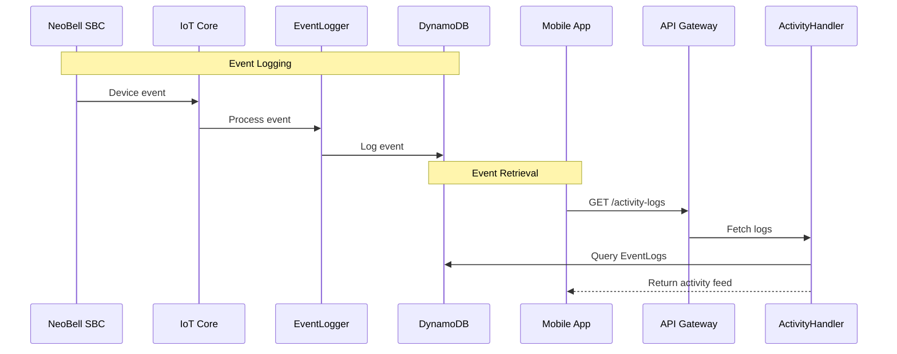

# Activity Logs API

## Overview
Provides a comprehensive activity feed for monitoring device events, user actions, and system notifications.

## API Handler
`NeoBellActivityLogHandler`

## Workflow Diagram



## Endpoints

### 1. Get Activity Logs
- **Method**: GET
- **Path**: `/activity-logs`
- **Auth**: Required (Cognito JWT)
- **Query Parameters**:
  - `event_types`: Comma-separated list of event types
  - `sbc_id`: Filter by device
  - `start_date`: ISO8601 timestamp
  - `end_date`: ISO8601 timestamp
  - `limit`: Number of items
  - `last_evaluated_key`: Pagination key
- **Response (200 OK)**:
```json
{
    "items": [
        {
            "log_source_id": "sbc_device_id_1",
            "timestamp_uuid": "YYYY-MM-DDTHH:mm:ss.sssZ_unique_suffix",
            "event_type": "doorbell_pressed",
            "timestamp": "YYYY-MM-DDTHH:mm:ssZ",
            "summary": "Campainha tocada na Porta da Frente.",
            "sbc_id_related": "sbc_device_id_1",
            "user_id_related": "cognito_sub_uuid_related",
            "details": {
                "message_id_if_any": "message_uuid_for_video_recado"
            }
        }
    ],
    "last_evaluated_key": "optional_pagination_key_stringified_json_complex"
}
```

## Data Model

### EventLogs Table
```javascript
{
    "log_source_id": "string (PK)",
    "timestamp_uuid": "string (SK)",
    "event_type": "string",
    "timestamp": "string",
    "summary": "string",
    "sbc_id_related": "string",
    "user_id_related": "string",
    "details": {
        // Event-specific details
    }
}
```

### Event Types
1. Device Events
   - `doorbell_pressed`
   - `video_message_recorded`
   - `package_detected`
   - `visitor_detected`
   - `device_status_change`

2. User Events
   - `user_access_granted`
   - `user_access_removed`
   - `settings_changed`
   - `permission_updated`

3. System Events
   - `firmware_update`
   - `device_registered`
   - `device_removed`
   - `error_occurred`

## Error Handling

| Status Code | Description | Common Causes |
|------------|-------------|---------------|
| 400 | Bad Request | Invalid parameters |
| 401 | Unauthorized | Invalid token |
| 403 | Forbidden | Access denied |
| 500 | Server Error | Processing error |

## Integration Examples

### Device Integration
```javascript
// IoT Core message format
{
    "event_type": "doorbell_pressed",
    "sbc_id": "device_123",
    "timestamp": "2025-06-02T20:00:00Z",
    "details": {
        "visitor_detected": true,
        "video_recorded": true
    }
}
```

### Mobile App Integration
```javascript
// Activity feed query parameters
{
    "event_types": "doorbell_pressed,package_detected",
    "sbc_id": "device_123",
    "start_date": "2025-06-01T00:00:00Z",
    "end_date": "2025-06-02T23:59:59Z",
    "limit": 50
}