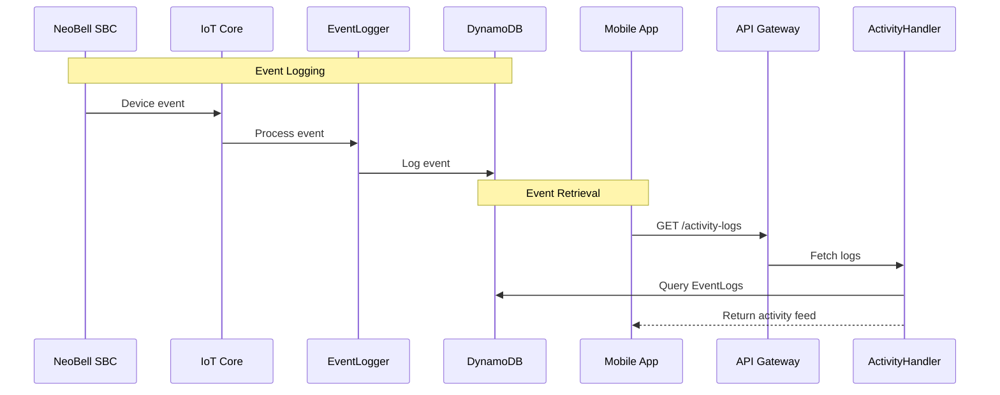

# Activity Logs API

## Overview
Provides a comprehensive activity feed for monitoring device events, user actions, and system notifications.

## API Handler
`NeoBellActivityLogHandler`

## Workflow Diagram



## Endpoints
2. Gerenciamento de Dispositivos NeoBell (NeoBellDeviceHandler)
Endpoints para listar, detalhar, atualizar, deletar dispositivos NeoBell (SBCs) e gerenciar os usuários vinculados a eles.
2.1. Listar Dispositivos do Usuário
Método: GET
Caminho: /devices
Handler Lambda: NeoBellDeviceHandler
Autenticação: Requerida (Cognito JWT)
Descrição: Lista todos os dispositivos NeoBell aos quais o usuário autenticado está vinculado (como Proprietário ou Residente). A função Lambda consulta DeviceUserLinks e enriquece com dados de NeoBellDevices.
Parâmetros de Caminho: Nenhum.
Parâmetros de Query String (Opcionais):
limit (Number): Número máximo de itens a retornar.
last_evaluated_key (String): Chave para paginação.
Corpo da Requisição: Nenhum.
Resposta de Sucesso (200 OK):
{
    "items": [
        {
            "sbc_id": "device_uuid_1",
            "device_friendly_name": "Porta da Frente",
            "role_on_device": "Owner", // Ou "Resident"
            "status": "online",
            "last_seen": "YYYY-MM-DDTHH:mm:ssZ"
        }
        // ... mais dispositivos
    ],
    "last_evaluated_key": "optional_pagination_key_stringified_json"
}


Possíveis Erros: 400 (parâmetros de query inválidos), 401, 403, 500.
2.2. Obter Detalhes de um Dispositivo Específico
Método: GET
Caminho: /devices/{sbc_id}
Handler Lambda: NeoBellDeviceHandler
Autenticação: Requerida (Cognito JWT)
Descrição: Obtém informações detalhadas sobre um dispositivo NeoBell específico, desde que o usuário autenticado esteja vinculado a ele. A função Lambda verifica o link em DeviceUserLinks e busca dados em NeoBellDevices.
Parâmetros de Caminho:
sbc_id (String, Obrigatório): O ID do dispositivo NeoBell (SBC).
Parâmetros de Query String: Nenhum.
Corpo da Requisição: Nenhum.
Resposta de Sucesso (200 OK):
{
    "sbc_id": "device_uuid_1",
    "owner_user_id": "owner_cognito_sub_uuid",
    "device_friendly_name": "Porta da Frente",
    "user_role_on_device": "Owner", // Papel do usuário solicitante neste dispositivo
    "status": "online",
    "firmware_version": "1.2.3",
    "registered_at": "YYYY-MM-DDTHH:mm:ssZ",
    "last_seen": "YYYY-MM-DDTHH:mm:ssZ",
    "network_info": {
        "ip_address": "192.168.1.100",
        "wifi_ssid": "MinhaRedeWifi",
        "signal_strength": -45
    }
}


Possíveis Erros: 400 (sbc_id ausente), 401, 403 (usuário não vinculado ao dispositivo), 404 (dispositivo não encontrado), 500.
2.3. Atualizar Detalhes de um Dispositivo
Método: PUT
Caminho: /devices/{sbc_id}
Handler Lambda: NeoBellDeviceHandler
Autenticação: Requerida (Cognito JWT)
Descrição: Permite que o 'Proprietário' de um dispositivo NeoBell atualize seus detalhes editáveis (ex: nome amigável). A função Lambda verifica a propriedade e atualiza NeoBellDevices.
Parâmetros de Caminho:
sbc_id (String, Obrigatório): O ID do dispositivo NeoBell (SBC).
Parâmetros de Query String: Nenhum.
Corpo da Requisição (application/json):
{
    "device_friendly_name": "Nova Câmera da Porta da Frente"
}


Resposta de Sucesso (200 OK):
{
    "sbc_id": "device_uuid_1",
    "device_friendly_name": "Nova Câmera da Porta da Frente",
    "last_updated_app_at": "YYYY-MM-DDTHH:mm:ssZ"
}


Possíveis Erros: 400 (corpo inválido ou sbc_id ausente), 401, 403 (solicitante não é o proprietário), 404 (dispositivo não encontrado), 500.
2.4. Desregistrar (Deletar) um Dispositivo
Método: DELETE
Caminho: /devices/{sbc_id}
Handler Lambda: NeoBellDeviceHandler
Autenticação: Requerida (Cognito JWT)
Descrição: Permite que o 'Proprietário' de um dispositivo NeoBell o desregistre do sistema. Isso envolve remover o dispositivo de NeoBellDevices e todos os seus links de DeviceUserLinks.
Parâmetros de Caminho:
sbc_id (String, Obrigatório): O ID do dispositivo NeoBell (SBC).
Parâmetros de Query String: Nenhum.
Corpo da Requisição: Nenhum.
Resposta de Sucesso (204 No Content): Nenhum corpo na resposta.
Possíveis Erros: 400 (sbc_id ausente), 401, 403 (solicitante não é o proprietário), 404 (dispositivo não encontrado, embora possa retornar 204), 500.
2.5. Listar Usuários de um Dispositivo
Método: GET
Caminho: /devices/{sbc_id}/users
Handler Lambda: NeoBellDeviceHandler
Autenticação: Requerida (Cognito JWT)
Descrição: Permite que o 'Proprietário' de um dispositivo NeoBell visualize a lista de todos os usuários (Proprietários e Residentes) vinculados a esse dispositivo. A função Lambda verifica a propriedade, consulta DeviceUserLinks e enriquece com dados de NeoBellUsers.
Parâmetros de Caminho:
sbc_id (String, Obrigatório): O ID do dispositivo NeoBell (SBC).
Parâmetros de Query String (Opcionais):
limit (Number): Número máximo de itens a retornar.
last_evaluated_key (String): Chave para paginação.
Corpo da Requisição: Nenhum.
Resposta de Sucesso (200 OK):
{
    "items": [
        {
            "user_id": "owner_cognito_sub_uuid",
            "email": "owner@example.com",
            "name": "Owner Name",
            "role": "Owner",
            "access_granted_at": "YYYY-MM-DDTHH:mm:ssZ"
        },
        {
            "user_id": "resident_cognito_sub_uuid",
            "email": "resident@example.com",
            "name": "Resident Name",
            "role": "Resident",
            "access_granted_at": "YYYY-MM-DDTHH:mm:ssZ"
        }
        // ... mais usuários
    ],
    "last_evaluated_key": "optional_pagination_key_stringified_json"
}


Possíveis Erros: 400 (sbc_id ausente ou parâmetros de query inválidos), 401, 403 (solicitante não é o proprietário), 404 (dispositivo não encontrado), 500.
2.6. Adicionar Usuário a um Dispositivo (Convidar)
Método: POST
Caminho: /devices/{sbc_id}/users
Handler Lambda: NeoBellDeviceHandler
Autenticação: Requerida (Cognito JWT)
Descrição: Permite que o 'Proprietário' de um dispositivo convide/adicione outro usuário NeoBell registrado (identificado por e-mail) como 'Residente' (ou outro papel permitido) ao dispositivo. A função Lambda verifica a propriedade, encontra o user_id do convidado e cria um novo link em DeviceUserLinks.
Parâmetros de Caminho:
sbc_id (String, Obrigatório): O ID do dispositivo NeoBell (SBC).
Parâmetros de Query String: Nenhum.
Corpo da Requisição (application/json):
{
    "email_of_invitee": "resident_to_add@example.com",
    "role": "Resident" // Papel a ser atribuído
}


Resposta de Sucesso (201 Created ou 200 OK):
{
    "sbc_id": "device_uuid_1",
    "user_id": "invitee_cognito_sub_uuid", // ID do usuário convidado
    "email_of_invitee": "resident_to_add@example.com",
    "role": "Resident",
    "access_granted_at": "YYYY-MM-DDTHH:mm:ssZ"
}


Possíveis Erros: 400 (corpo inválido, sbc_id ausente), 401, 403 (solicitante não é o proprietário), 404 (usuário convidado não encontrado no Cognito, ou dispositivo não encontrado), 409 (usuário já vinculado ao dispositivo), 500.
2.7. Remover Usuário de um Dispositivo
Método: DELETE
Caminho: /devices/{sbc_id}/users/{user_id_to_remove}
Handler Lambda: NeoBellDeviceHandler
Autenticação: Requerida (Cognito JWT)
Descrição: Permite que o 'Proprietário' de um dispositivo remova o acesso de um usuário vinculado, ou que um 'Residente' remova a si mesmo. A função Lambda verifica as permissões e remove o link de DeviceUserLinks.
Parâmetros de Caminho:
sbc_id (String, Obrigatório): O ID do dispositivo NeoBell (SBC).
user_id_to_remove (String, Obrigatório): O user_id (Cognito sub) do usuário a ser removido do dispositivo.
Parâmetros de Query String: Nenhum.
Corpo da Requisição: Nenhum.
Resposta de Sucesso (204 No Content): Nenhum corpo na resposta.
Possíveis Erros: 400 (parâmetros de caminho ausentes), 401, 403 (permissão negada para remover o usuário), 404 (dispositivo, usuário ou link não encontrado, embora possa retornar 204), 500.


## Data Model

### EventLogs Table
```javascript
{
    "log_source_id": "string (PK)",
    "timestamp_uuid": "string (SK)",
    "event_type": "string",
    "timestamp": "string",
    "summary": "string",
    "sbc_id_related": "string",
    "user_id_related": "string",
    "details": {
        // Event-specific details
    }
}
```

### Event Types
1. Device Events
   - `doorbell_pressed`
   - `video_message_recorded`
   - `package_detected`
   - `visitor_detected`
   - `device_status_change`

2. User Events
   - `user_access_granted`
   - `user_access_removed`
   - `settings_changed`
   - `permission_updated`

3. System Events
   - `firmware_update`
   - `device_registered`
   - `device_removed`
   - `error_occurred`

## Error Handling

| Status Code | Description | Common Causes |
|------------|-------------|---------------|
| 400 | Bad Request | Invalid parameters |
| 401 | Unauthorized | Invalid token |
| 403 | Forbidden | Access denied |
| 500 | Server Error | Processing error |

## Integration Examples

### Device Integration
```javascript
// IoT Core message format
{
    "event_type": "doorbell_pressed",
    "sbc_id": "device_123",
    "timestamp": "2025-06-02T20:00:00Z",
    "details": {
        "visitor_detected": true,
        "video_recorded": true
    }
}
```

### Mobile App Integration
```javascript
// Activity feed query parameters
{
    "event_types": "doorbell_pressed,package_detected",
    "sbc_id": "device_123",
    "start_date": "2025-06-01T00:00:00Z",
    "end_date": "2025-06-02T23:59:59Z",
    "limit": 50
}