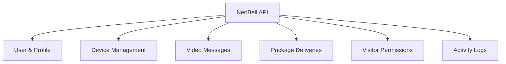
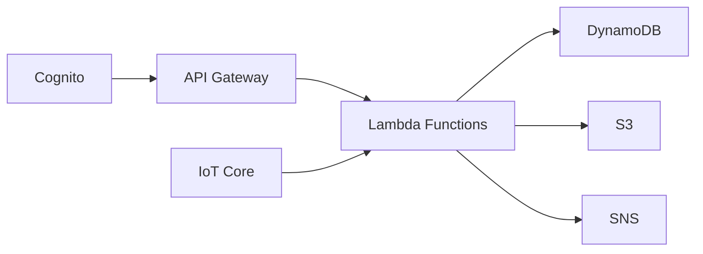

# NeoBell API Documentation

## Overview
This documentation covers the REST APIs and workflows for the NeoBell system, organized by functional domains.

## API Documentation Structure



## API Modules

### 1. [User & Profile Management](01_user_profile_api.md)
- User profile operations
- Device token management
- NFC tag management
- Handler: `NeoBellUserHandler`

### 2. [Device Management](02_device_management_api.md)
- Device registration and updates
- Device user access control
- Device status monitoring
- Handler: `NeoBellDeviceHandler`

### 3. [Video Messages](03_video_messages_api.md)
- Message metadata management
- Video storage and retrieval
- Viewing URL generation
- Handler: `NeoBellMessageHandler`

### 4. [Package Deliveries](04_package_deliveries_api.md)
- Delivery tracking
- Package status management
- Notifications
- Handler: `NeoBellDeliveryHandler`

### 5. [Visitor Permissions](05_visitor_permissions_api.md)
- Face recognition integration
- Access control management
- Permission levels
- Handler: `NeoBellVisitorHandler`

### 6. [Activity Logs](06_activity_logs_api.md)
- Event monitoring
- Activity feed
- System notifications
- Handler: `NeoBellActivityLogHandler`

## Common Elements

### Authentication
All APIs require authentication via Cognito JWT tokens:
```http
Authorization: Bearer <ID_TOKEN>
```

### Base URL
```
https://{API_ID}.execute-api.us-east-1.amazonaws.com/{API_STAGE}
```

### Response Formats
All responses follow a standard format:
```json
{
    "data": {},        // Success response data
    "error": {},       // Error details if applicable
    "pagination": {}   // Pagination details if applicable
}
```

### HTTP Status Codes
- `200`: Success
- `201`: Created
- `204`: No Content
- `400`: Bad Request
- `401`: Unauthorized
- `403`: Forbidden
- `404`: Not Found
- `409`: Conflict
- `500`: Server Error

## AWS Service Integration



## Development Guidelines

### Security
- All endpoints require authentication
- Role-based access control
- Input validation
- Rate limiting

### Performance
- Pagination for list operations
- Efficient queries
- Response caching
- Resource optimization

### Error Handling
- Consistent error formats
- Detailed error messages
- Proper status codes
- Error logging

## Additional Resources
- [Architecture Overview](../device_management_module.md)
- [AWS Service Configuration](https://docs.aws.amazon.com)
- [API Testing Guide](https://docs.aws.amazon.com/apigateway)
- [Security Best Practices](https://docs.aws.amazon.com/security)