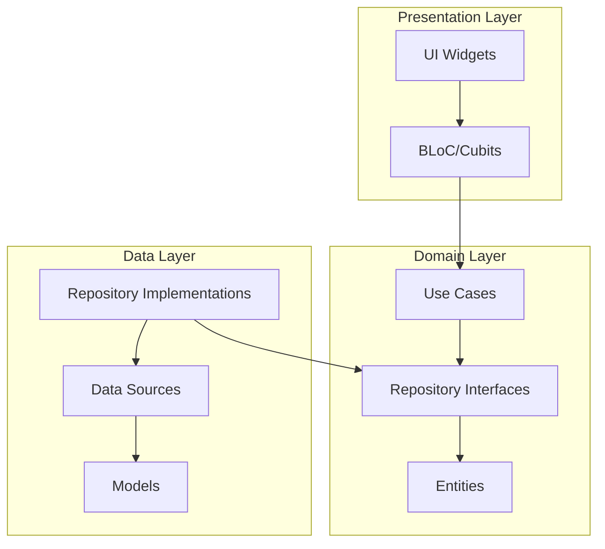

# NeoBell Mobile Application - Architecture Review

## Current Architecture Analysis

### 1. Clean Architecture Implementation

#### Strengths
- Clear separation of concerns with distinct layers (Presentation, Domain, Data)
- Well-organized feature-first directory structure
- Proper dependency injection using `get_it`
- Use of interfaces (repositories) for abstraction
- Error handling with Either type from `fpdart`

#### Implementation Details


### 2. State Management (BLoC)

#### Strengths
- Consistent use of BLoC pattern across features
- Clear separation of events, states, and business logic
- Proper error handling and state transitions
- Use of Cubits for simpler state management cases

#### Implementation Example
```dart
AuthBloc extends Bloc<AuthEvent, AuthState> {
  // Events mapped to state transitions
  // Clear error handling
  // Integration with use cases
}
```

### 3. Navigation (GoRouter)

#### Current Implementation
- Centralized routing configuration
- Type-safe route parameters
- Deep linking support
- Integration with BLoC for navigation state management

### 4. AWS Integration Architecture

#### Current Services
- Cognito: Authentication and user management
- API Gateway: RESTful API endpoints
- DynamoDB: Data persistence
- S3: File storage
- Firebase: Push notifications (hybrid approach)

## Identified Risks and Challenges

1. **AWS Service Dependencies**
   - Multiple service dependencies increase potential failure points
   - Need for robust error handling and offline support
   - Potential cost management concerns

2. **State Management Complexity**
   - Multiple BLoCs/Cubits could lead to state management complexity
   - Potential memory leaks if not properly disposed

3. **Security Considerations**
   - Token management and secure storage
   - API security and data encryption
   - File upload/download security
