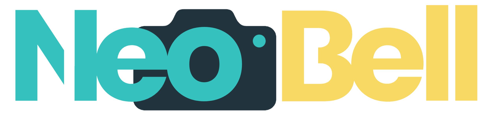

# NeoBell - Smart Residential Reception System

<div align="center">
  
  
  **Securely connected. Simply Home.**
  
  [](https://flutter.dev)
  [](https://aws.amazon.com)
  [](https://python.org)
  [](LICENSE)
</div>

## 🏠 Project Overview

**NeoBell** is an intelligent and multifunctional residential reception system designed to modernize the interaction with your home's entrance. The solution transforms traditional doorbells into a comprehensive smart home security and communication platform.

### Key Capabilities

- 🎥 **Video Messages**: Visitors can leave video messages when you're not home
- 📦 **Secure Package Delivery**: Protected compartment with NFC access control
- 👤 **Facial Recognition**: AI-powered visitor identification and permissions
- 🔒 **Smart Access Control**: Granular permissions for residents and visitors
- 📱 **Real-time Notifications**: Instant alerts on your mobile device
- 🎯 **QR Code Integration**: Package tracking and delivery management

## 🏗️ System Architecture

NeoBell consists of three integrated components working together:

```
┌─────────────────────────────────────────────────────────────────────────────┐
│                            NeoBell Ecosystem                                │
├─────────────────┬─────────────────────┬─────────────────────────────────────┤
│                 │                     │                                     │
│  📱 Mobile App  │   ☁️ AWS Backend    │    🖥️ SBC Device (Firmware)        │
│   (Flutter)     │   (Serverless)      │    (Radxa Rock 5C)                  │
│                 │                     │                                     │
│ • User Interface│ • API Gateway       │ • Local AI Processing               │
│ • Notifications │ • Lambda Functions  │ • Facial Recognition                │
│ • Device Control│ • DynamoDB Storage  │ • Voice Intent Recognition          │
│ • Video Viewing │ • S3 Media Storage  │ • QR Code/Data Matrix Reading       │
│ • Access Mgmt   │ • Cognito Auth      │ • Camera & Sensors                  │
│ • Real-time     │ • IoT Core (MQTT)   │ • Hardware Control                  │
│   Updates       │ • SNS Notifications │ • Local Storage                     │
│                 │                     │                                     │
└─────────────────┴─────────────────────┴─────────────────────────────────────┘
     │                   │        │                      │
     └───────────────────┘        └──────────────────────┘
    Real-time Communication        Real-time Communication
       (HTTP - RESTful)                   (MQTT)
```

### Component Details

#### 📱 **Mobile Application** ([`App/NeoBell/`](App/NeoBell/))
- **Technology**: Flutter 3.7.0+ (Android)
- **Architecture**: Clean Architecture with BLoC/Cubit state management
- **Features**: Device management, video playback, visitor permissions, package tracking
- **Integration**: AWS Amplify (Cognito), REST API calls, Firebase notifications

#### ☁️ **AWS Cloud Backend** ([`AWS/`](AWS/))
- **Architecture**: Serverless and event-driven
- **Services**: API Gateway, Lambda, DynamoDB, S3, IoT Core, SNS, Cognito
- **Language**: Python 3.8+ with Boto3
- **Features**: User management, device communication, media storage, real-time messaging

#### 🖥️ **SBC Device Firmware** (`Firmware/`) *(In Development)*
- **Hardware**: Radxa Rock 5C Single Board Computer
- **Capabilities**: Local AI processing, facial recognition, voice commands, QR scanning
- **Communication**: MQTT via AWS IoT Core, local storage, camera control

## 📁 Project Structure

```
NeoBell/
├── 📱 App/NeoBell/              # Flutter mobile application
│   ├── lib/
│   │   ├── core/                # Shared infrastructure
│   │   └── features/            # Feature-based modules
│   ├── android/                 # Android-specific configurations
│   ├── assets/                  # App assets and resources
│   └── README.md                # Mobile app documentation
│
├── ☁️ AWS/                      # Cloud infrastructure & backend
│   ├── lambda/                  # Specialized Lambda functions
│   ├── iot/                     # IoT Core configuration scripts
│   ├── sns notification/        # Push notification setup
│   ├── mock/                    # Development data scripts
│   └── README.md                # AWS infrastructure documentation
│
├── 🖥️ Firmware/                 # SBC device firmware (In Development)
│   └── README.md                # Firmware documentation
│
├── 🎨 Logos/                    # Brand assets and logos
│   ├── NeoBell_logo.png         # Main logo
│   ├── NB_logo.png              # Compact NB logo
│   ├── NB_white_logo.png        # Compact NB logo in all white (Notifications)
│   └── NB_black_logo.png        # Compact NB logo in all black (Notifications)
│
└── README.md                    # This file - Project overview
```

## 🚀 Quick Start

### Prerequisites

- **Development Environment**
  - Flutter SDK 3.7.0+
  - Android Studio or VS Code
  - Python 3.8+
  - AWS CLI configured

- **AWS Account**
  - AdministratorAccess permissions (for initial setup)
  - Available in `us-east-1` region

### 1. Clone the Repository

```bash
git clone <repository-url>
cd NeoBell
```

### 2. Set Up AWS Backend

```bash
cd AWS
# Follow the setup instructions in AWS/README.md
python create_neobell_iam_boto3.py
# ... continue with other AWS setup scripts
```

### 3. Configure Mobile App

```bash
cd App/NeoBell
flutter clean
flutter pub get

# Update API endpoints in lib/core/constants/api_constants.dart
# Configure Cognito settings in lib/features/auth/core/auth_init.dart
```

### 4. Run the Application

```bash
# In App/NeoBell directory
flutter run
```

### 5. Deploy Firmware

```bash
cd Firmware
# Follow firmware deployment instructions
```

## 💡 Key Features

### 🎥 **Visitor Video Messages**
- Visitors can record and leave video messages when residents are away
- Secure video storage in AWS S3 with temporary access URLs
- Push notifications alert residents of new messages
- Message management through the mobile app

### 📦 **Secure Package Delivery**
- Protected compartment with NFC-controlled access
- QR code and Data Matrix scanning for package tracking
- Integration with delivery services
- Automated notifications for package arrivals

### 👤 **Intelligent Access Control**
- AI-powered facial recognition for visitor identification
- Permission system for different types of visitors
- Voice intent recognition for hands-free interaction

### 📱 **Mobile Management**
- Real-time device monitoring and control
- User management for multi-resident properties
- Activity logs and security monitoring
- Customizable notification preferences

## 🛠️ Technology Stack

### **Frontend (Mobile)**
- **Framework**: Flutter 3.7.0+
- **Language**: Dart
- **State Management**: BLoC/Cubit pattern
- **Navigation**: GoRouter
- **Authentication**: AWS Amplify (Cognito)

### **Backend (Cloud)**
- **Platform**: AWS Serverless
- **Language**: Python 3.8+ with Boto3
- **Architecture**: Event-driven microservices
- **Database**: DynamoDB (NoSQL)
- **Storage**: S3 (Videos, Images)
- **Communication**: IoT Core (MQTT), API Gateway (REST)

### **Hardware (SBC)**
- **Device**: Radxa Rock 5C
- **OS**: Linux-based
- **AI**: Local processing for facial recognition
- **Connectivity**: Wi-Fi
- **Sensors**: Camera, microphone, speakers, NFC reader

## 🔐 Security Features

### **Multi-layered Security**
- **End-to-end Encryption**: All communications encrypted
- **AWS IAM**: Principle of least privilege access control
- **VPC Isolation**: Backend services in private subnets
- **Biometric Authentication**: Local device security
- **Token Management**: Automatic JWT refresh and validation

### **Privacy Protection**
- **Local AI Processing**: Facial recognition performed on-device
- **Temporary URLs**: Time-limited access to media files
- **Data Encryption**: SSE-S3 enabled, encrypted DynamoDB
- **GDPR Compliance**: User data management and deletion capabilities

## 📚 Documentation

### Component Documentation
- 📱 **Mobile App**: [`App/NeoBell/README.md`](App/NeoBell/README.md)
- ☁️ **AWS Backend**: [`AWS/README.md`](AWS/README.md)
- 🖥️ **Firmware**: [`Firmware/README.md`](Firmware/README.md)

### Additional Resources
- [Flutter Documentation](https://docs.flutter.dev/)
- [AWS Documentation](https://docs.aws.amazon.com/)
- [Radxa Rock 5C Documentation](https://docs.radxa.com/)

## 🤝 Contributing

### Development Workflow
1. **Follow Clean Architecture** principles in all components
2. **Maintain documentation** for new features and changes
3. **Test thoroughly** before committing changes
4. **Use consistent coding standards** across the project

### Code Style
- **Flutter**: Follow Dart style guide and use `flutter analyze`
- **Python**: Follow PEP 8 and use type hints
- **Documentation**: Use clear, concise language with examples

## 📄 License

This project is proprietary software developed for the NeoBell smart residential reception system. All rights reserved.

## 🚨 Important Notes

### Development Environment
- **AWS Region**: All resources created in `us-east-1`
- **Costs**: Monitor AWS usage to avoid unexpected charges
- **Credentials**: Never commit AWS credentials or API keys
- **Testing**: Use mock data scripts for development

### Production Deployment
- **Security**: Review all IAM policies before production
- **Monitoring**: Enable CloudWatch logging and monitoring
- **Backup**: Ensure DynamoDB Point-in-Time Recovery is enabled
- **Updates**: Test firmware updates in development environment first

---

<div align="center">
  
**NeoBell** - Transforming home security and visitor interaction through intelligent technology.

*Securely connected. Simply Home.*

</div>
